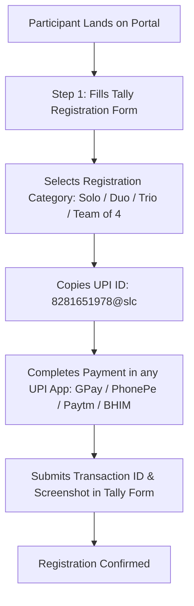

<div align="center">

# 🚀 UNFOLD 2026 - Official Registration & Payment Portal

[](https://unfold26-upi-payment.vercel.app/)
[](https://ia.ie.pels.ieeekerala.org)
[](LICENSE)
[](https://unfold26-upi-payment.vercel.app/)

<br />

### 🌐 **Live Website**: [https://unfold26-upi-payment.vercel.app/](https://unfold26-upi-payment.vercel.app/)

<p align="center">
  Official registration portal for <b>UNFOLD 2026</b> — A 48-Hour Residential Startup Bootcamp for Students and Young Professionals held at Christ College of Engineering, Irinjalakuda. Hosted by IEEE IA/IE/PELS Jt. Chapter Kerala.
</p>

</div>

---

## 🎨 Theme & Aesthetic System

Designed from the ground up to strictly mirror the **Official UNFOLD 2026 Poster Palette** and provide 100% seamless visual integration with embedded Tally forms:

- 📜 **Warm Cream Paper Canvas (`#F5F2EC`)**: Matches the poster texture and off-white backdrop.
- ☕ **Deep Earthy Espresso Typography (`#3B2D25`)**: High contrast typography based on official branding.
- 🏷️ **Dashed Outline Badges (`1.5px dashed #8C7261`)**: Styled directly after poster tags ("Residential Startup Bootcamp...").
- 📄 **Seamless Embedded Tally Form**: Zero contrast mismatch between Tally's white background and the site card container.

---

## 📋 Features

- 📑 **Integrated Tally Form (`A7Y8Zl`)**: Embedded directly inside Step 1 using Tally's dynamic height iframe engine (`embed.js`).
- 💸 **Universal UPI Deep Link Engine**: Fully compatible with Google Pay, PhonePe, Paytm, BHIM, Slice, Super.money, and all NPCI-compliant UPI applications.
- 📱 **Clean Copy-to-Clipboard Workflow**: Allows participants to copy UPI ID (`8281651978@slc`) with visual morphing feedback (`✓ Copied!`).
- 🔒 **Tally Category Sync & Auto-Locking**: Supports ticket URL parameter locking (`?ticket=solo`, `?ticket=team2`, `?ticket=team3`, `?ticket=team4`).
- ⚡ **Zero Backend Overhead**: 100% static HTML5/CSS3/JS architecture deployed on Vercel CDN for ultra-fast page loads under 100ms.

---

## 🔄 User Journey & Architecture



---

## 🎟️ Ticket Tiers Catalog

| Pass Key | Pass Name | Participant Count | Fee (INR) | Query Parameter |
| :--- | :--- | :---: | :---: | :--- |
| `solo` | **Solo Pass** | 1 | **₹799** | `?ticket=solo` |
| `duo` | **Team of 2** | 2 | **₹1,398** | `?ticket=team2` |
| `trio` | **Team of 3** | 3 | **₹2,097** | `?ticket=team3` |
| `team4` | **Team of 4** | 4 | **₹2,796** | `?ticket=team4` |

---

## 📂 Project Structure

```
UNFOLD 2026/
├── index.html              # HTML5 Semantic structure & Tally Embed container
├── css/
│   └── style.css           # UNFOLD poster warm cream & deep espresso design system
├── js/
│   ├── config.js           # Ticket catalog, UPI deep link builder & parameter sanitizer
│   ├── main.js             # Copy controller, modal manager & Tally event handshake
│   └── qrcode.min.js       # Client-side QR engine fallback
├── assets/
│   ├── ieee-chapter-logo.png      # Official IEEE IA/IE/PELS Jt. Chapter Kerala Banner
│   ├── ieee-chapter-logo-dark.png # Header Banner image
│   └── favicon.svg                # Event Favicon
├── vercel.json             # Vercel CDN deployment routing configuration
└── README.md               # Project documentation
```

---

## 🛠️ Local Development & Setup

1. **Clone the Repository**:
   ```bash
   git clone https://github.com/KevinGeorge100/unfold26-upi-payment.git
   cd unfold26-upi-payment
   ```

2. **Run Locally**:
   Simply open `index.html` in any web browser or start a local HTTP server:
   ```bash
   npx serve .
   ```

3. **Deploy to Vercel**:
   ```bash
   npx vercel --prod
   ```

---

## 👥 Organizers & Attribution

- **Organized By**: IEEE IA/IE/PELS Jt. Chapter Kerala
- **Host Institution**: Christ College of Engineering (Autonomous), Irinjalakuda
- **Event Date**: September 12 & 13, 2026
- **Official Website**: [ia.ie.pels.ieeekerala.org](https://ia.ie.pels.ieeekerala.org)

---

<div align="center">
  <sub>Built with ❤️ for UNFOLD 2026 • Hosted on Vercel</sub>
</div>
